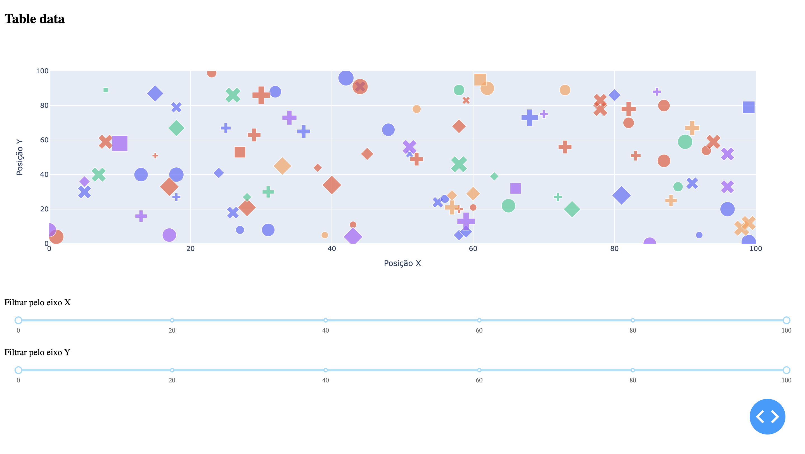

# Data viz


## Sobre o projeto
O projeto consiste em uma aplicação que gera um gráfico a partir de um arquivo csv. O usuário pode filtrar os dados por eixo x e y.
## Features
- Geração de gráfico a partir de um arquivo csv
- Filtragem de dados por eixo x e y
## Requerimentos
- Python 3.10+
- Pip 21.1+
## Rodando o projeto
Primeiro, entre na pasta do projeto e instale as dependências do projeto:
```
pip install -r requirements.txt

ou

pip3 install -r requirements.txt
```

Segundo, inicie o projeto:
```
python3 main.py

```